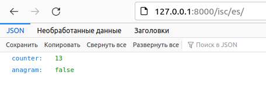
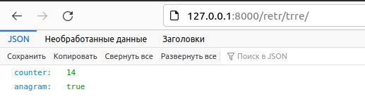
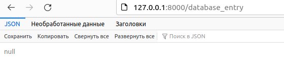
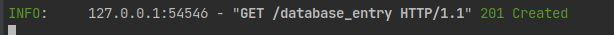
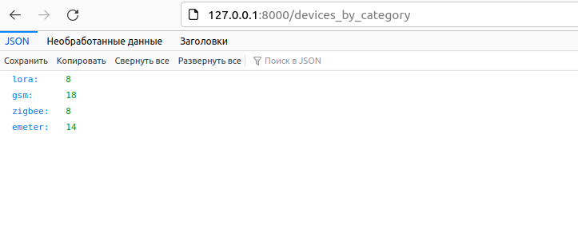

#                    Приложение devices_API
___

# Предварительная установка

- ### Прежде все необходимо установить сам репозиторий с github
  ```git clone https://github.com/Mr-Dino/devices_API```
- ###  Переходим в консоли в репозиторий 
    ```cd devices_API```
- ### Устанавливаем зависимости 
  ```pip install -r requirements.txt```
- ### Поднимаем сервер redis
  ```redis-server```
- ### Запускаем локально наше приложение
  ```uvicorn main:app --reload```

# Работа с приложением
## Заходим в браузер 
- ## Проверка слов на принадлежность к анаграммам 
> Для проверки на принадлежность слов к анаграммам нужно перейти по адресу ```127.0.0.1:8000```,
> и  в качестве параметров передать слова, которые хотим проверить, через знак ```/```.
> Пример: http://127.0.0.1:8000/isc/es.


> Как можно увидеть, счетчик не увеличился, а параметр ```anagram``` имеет значение - false,
> поскольку слова ```isc``` и ```es``` не являются анаграммами.

> Пример реакции приложения на слова анаграммы:



- ## Добавление записей в БД 
> При переходе по адресу http://127.0.0.1:8000/database_entry
> - Добавляются 10 записей в таблицу ```devices```, ```dev_id``` и ```dev_type``` генерируются рандомно;
> - Добавляются 5 id из таблицы ```devices``` в таблицу ``endpoints``;
> - Возвращается статус-код.



> Код, возвращаемый при успешном добавлении всех данных:



- ## Получение записей из таблицы ```devices```

> При переходе по адресу http://127.0.0.1:8000/devices_by_category выполняются следующие действия:
> - Получаются данные из таблицы ```devices```, которые не входят в таблицу ```endpoints```  
> и сразу же группируются по параметру ```dev_type```;
> - Далее полученные данные выводятся в json формате.



----
# Примеры данных в БД

### Таблица devices
<table>
  <tr>
    <th>id</th>
    <th>dev_id</th>
    <th>dev_type</th>
  </tr>
  <tr>
    <td>1</td>
    <td>9c:8d:3f:89:0f:c9</td>
    <td>lora</td>
  </tr>
  <tr>
    <td>2</td>
    <td>43:ba:80:2a:93:ac</td>
    <td>gsm</td>
  </tr>
  <tr>
    <td>3</td>
    <td>e6:27:cb:a9:65:35</td>
    <td>emeter</td>
  </tr>
</table>

### Таблица endpoints
<table>
  <tr>
    <th>id</th>
    <th>device_id</th>
    <th>comment</th>
  </tr>
  <tr>
    <td>1</td>
    <td>11</td>
    <td>NULL</td>
  </tr>
  <tr>
    <td>2</td>
    <td>1</td>
    <td>This is wonderful!</td>
  </tr>
  <tr>
    <td>3</td>
    <td>44</td>
    <td>Okey let's go.</td>
  </tr>
</table>